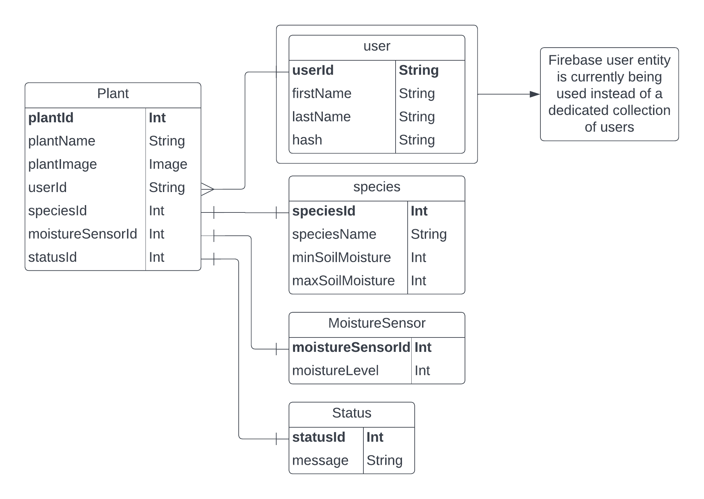

# PlantTime

## Team 2
Original dev team, further changes made by myself (robmifsud).

Adam Ruggier - **adamrugg**

Luke Chen - **lluke-chen**

Gerard Coleiro - **gercol01**

Robert Mifsud - **robmifsud**

## Our IoT App: PlantTime
PlantTime is a mobile application which allows users to monitor and water their plants.

## Screen Grabs
<p style='display: flex; direction: row; width: 100%; gap: 5px;'>
     
    
    
    
    
    
<p>

## Build
This project can be built and tested using Expo Go on ios or android. The server can be started as follows:
```
npx expo start
```

## Data Schema

